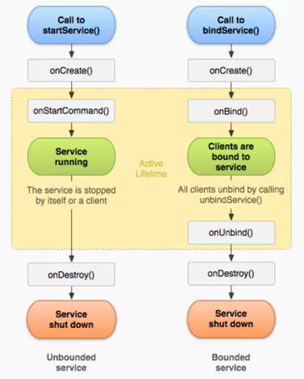

---
---
## Android有两种Service

|类别|特点|
|Local|本地Service，没有独立的进程|
|Remote|远程Service，独立进程，需要指定`android:process` 因为是独立进程，所以需要使用AIDL进行IPC|

## 启动方式

|启动方式|特点|停止方式|生命周期|
|startService|用于启动后台任务 不能进行通信|stopService|`onCreate()`：不管调几次startService，只调用一次 `onStart`：每次调startService都会调 `onDestroy()`:调stopService或自己调stopSelf时触发|
|bindService|可进行通信|unbindService|`onCreate()`：不管调几次bindService，只调用一次 `onDestroy()`:unbindService或绑定的activity关闭了|
|startService bindService|两种一起使用|unbindService stopService|`onCreate()`：不管调几次startService，只调用一次 `onStart`：每次调startService都会调 `onDestroy()`:调unbindService，再调用stopService或自己调stopSelf时触发|

## 生命周期

## onBind方法

用于在bindService时，返回IBinder实例对象，以实现Activity和Service之间的通讯。 
注意： 
如果onBind方法返回null，则ServiceConnection中的onServiceConnected方法不会调用，也就不能实现activity和service之间的通信了。 

## Service和Thread的区别

Service和Thread实际上没有什么关系。 

如果是本地Service，实际上是运行在主线程上的。 
如果是远程Service，实际上是运行在独立的进程上。 
