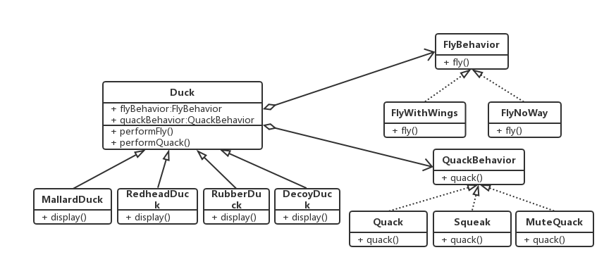

---
---

## 定义

策略模式定义了算法族，分别封装起来，让它们之间可以互相替换，此模式让算法的变化独立于使用算法的客户。

## 什么情况下使用策略模式

考虑继承带来的缺点：
当涉及到“维护”时，为了“复用”目的而使用继承，结局并不完美。
1. 代码在多个子类中重复
1. 运行时的行为不容易改变
1. 很难知道所有子类的全部行为
1. **改变会牵一发动全身，造成其他子类不想要的改变**

当你遇到继承带来的这些问题是，就可以考虑是否可以使用策略模式。

## 类图

