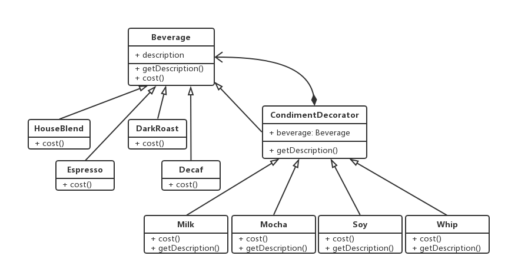

---
---

## 定义

动态地将责任附加到对象上。若要扩展功能，装饰者提供了比继承更有弹性的替代方案。

## 特点

* 装饰者和被装饰对象有相同的超类型
* 你可以用一个或多个装饰者包装一个对象
* 既然装饰者和被装饰对象有相同的超类型，那么在任何需要原始对象（被包装的）的场合，都可以用装饰过的对象代替它。
* **装饰者可以在所委托被装饰者的行为之前与/或之后，加上自己的行为，以达到特定的目的。**
* 对象可以在任何时候被装饰，所以可以在运行时动态地、不限量地用你喜欢的装饰者来装饰对象。

## 类图



`CondimentDecorator`是装饰者的基类，它持有`Beverage`(被装饰者)的对象。
`Milk`、`Mocha`、`Soy`和`Whip`都是装饰者的具体实现，他们可以重写`cost()`和`getDescription()`方法以达到装饰的目的。

## 用例

```Java
public class Main {
    public static void main(String args[]) {
        Beverage beverage = new Beverage();
        beverage = new Mocha(beverage);
        beverage = new Milk(beverage);
        System.out.println(beverage.getDescription() + "￥" + beverage.cost())
    }
}
```

## 缺点

利用装饰者模式，常常造成设计中有大量的小类，数量实在太多，可能会造成使用此API程序员的困扰。
