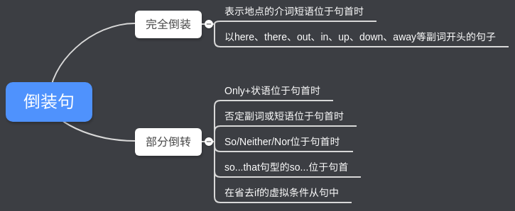

---
---

## 全部倒装

全部倒装是指将句子中的谓语动词全部置于主语之前。
此结构通常只用于一般现在时和一般过去时。
常见的结构有：

#### there be结构

> There are so many things to learn today.
今天有很多东西要学。

There are 是谓语
so many things 是主语

#### 表示时间的副词now,then等位于句首,主语是名词。
> Now comes a new opportunity , you must seize it.
现在新机会来了，你必须抓住它。

#### 表示方位的副词up,down,in,out,away等放在句首，谓语动词是come,go,run,rush,fly等，主语是名词

> Up went the fireworks into the air.
嗖的一声,焰火上了天。
when the door opened, out rushed the children.
当门打开时,孩子们冲了出去。

#### 介词短语放在句首作状语,谓语动词是lie, stand , sit ,exist , stretch , come等或系动词be,主语是名词时。

> At the foot of the mountain lies a clean stream.
山脚下有一条清澈的小溪。

#### 代词such放在句首,句子的谓语动词是be。

> Such is what he wanted.
这就是他想要的。

#### 表示运动方向的副词或地点状语置于句首，谓语表示运动的动词。

> Out rushed a missile from under the bomber.
Ahead sat an old woman.

***注意：上述全部倒装的句型结构的主语必须是名词，如果主语是人称代词则不能完全倒装。***
> Here he comes. Away they went.

## 部分倒装

部分倒装是指将谓语的一部分如助动词或情态倒装至主语之前。
如果句中的谓语没有助动词或情态动词，则需添加助动词do, does或did，并将其置于主语之前。

#### 句首为否定或半否定的词语，如 no, not, never, seldom, little, hardly, at no time, in no way, not until… 等。

###### not only位于句首时,引导的句子用部分倒装。
> Not only does he like football , but he is also fond of chess
他不但喜欢足球还喜欢象棋。

###### not until位于句首时,主句用部分倒装
> Not until midnight did his father come back.
直到半夜他的父亲才回来

###### 含有否定意义的的副词或介词短语位于句首时。
> Seldom in all my life have I met such a determined person.
在我的一生中我从未见过一个如此坚决的人。
By no means will I give in to you.
我决不会向你屈服的。

#### 以否定词开头作部分倒装

如 Not only...but also, Hardly/Scarcely...when, No sooner...than

> Not only did he refuse the gift, he also severely criticized the sender.
Hardly had she gone out when a student came to visit her.
No sooner had she gone out than a student came to visit her.

#### 重复倒装句（so, neither, nor作部分倒装）

以so/neither起首的倒装句，结构为so/neither＋谓语（助动词/be动词/情态动词）＋主语，
用于说明上文所描述的情况也同样适用于下文的人或物。
该结构中谓语动词的形式要和上文的谓语保持一致，数要由下文的主语来决定。

> He can sing a lot of English songs, so can she.他会唱很多英语歌曲，她也是。
She speaks English very well, so do I.她英语说得好，我也是。
Li Lei hasn’t read this book, neither has Lin Feng.李蕾没看过这本书，林风也没看过。

注意，
在“so＋谓语＋主语”的结构中，主语是另外的人或物，
而在“so＋主语＋谓语”的结构中，主语仍是上文的人或物，表示对上文所讲事实的肯定或强调，如
> She can play the piano, so she can.（她会弹钢琴，她的确会。）

#### only在句首要倒装的情况

> Only in this way, can you learn English well.
> Only after being asked three times did he come to the meeting.

注意：
如果句子为主从复合句，则主句倒装，从句不倒装
> Only when he is seriously ill, does he ever stay in bed.

#### as, though引导的倒装句

as/though引导的让步从句必须将表语或状语提前（形容词, 副词, 分词, 实义动词提前）。
注意：
* 句首名词不能带任何冠词。
* 句首是实义动词, 其他助动词放在主语后。如果实义动词有宾语和状语,随实义动词一起放在主语之前。

> Try hard as he will, he never seems able to do the work satisfactorily.
