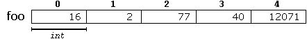
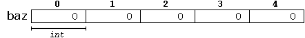

# 数组

注: 本文翻译自[C++官方网站](http://www.cplusplus.com/doc/tutorial/arrays/).
<!--
An array is a series of elements of the same type placed in contiguous memory locations that can be individually referenced by adding an index to a unique identifier.
-->
数组是一系列具有相同类型的元素的集合，这些元素存储在连续的内存区域中，每个内存区域都可以用*数组唯一标识符*加*索引*的形式访问。
<!--
That means that, for example, five values of type `int` can be declared as an array without having to declare 5 different variables (each with its own identifier). Instead, using an array, the five `int` values are stored in contiguous memory locations, and all five can be accessed using the same identifier, with the proper index.
-->
因此，如果需要声明5个`int`型的值，我们可以声明一个数组，而不需要单独声明5个变量。使用数组的好处是，这5个元素存储于连续的地址空间，并且可以用相同的标识符加对应的索引进行访问。
<!--
For example, an array containing 5 integer values of type `int` called `foo` could be represented as:
-->
&emsp;&emsp;例如，声明一个包含5个`int`型数据的数组`foo`：


<!--
where each blank panel represents an element of the array. In this case, these are values of type `int`. These elements are numbered from 0 to 4, being 0 the first and 4 the last; In C++, the first element in an array is always numbered with a zero (not a one), no matter its length.
-->
&emsp;&emsp;上图中每个白块代表数组中的一个元素。在这个例子中，数组中的元素是`int`类型的。这些元素用0到4进行编号，0是第一个，4是最后一个。在C++中，数组的第一个元素总是编号为0而不是1，不论数组中有多少个元素。
<!--
Like a regular variable, an array must be declared before it is used. A typical declaration for an array in C++ is:
-->
&emsp;&emsp;像普通变量一样，数组在使用之前也必须先声明。C++中，数组声明的标准格式为：`type name [elements];`
<!--
where `type` is a valid type (such as `int`, `float`...), `name` is a valid identifier and the `elements` field (which is always enclosed in square brackets `[]`), specifies the length of the array in terms of the number of elements.
-->
&emsp;&emsp;`type`代表有效的数据类型(例如，`int`, `float`...)；`name`代表一个有效的数组名标识符；`elements`必须包含在`[]`中，按照所需元素的个数指定数组长度。
<!--
Therefore, the `foo` array, with five elements of type `int`, can be declared as:
-->
&emsp;&emsp;因此，包含5个`int`型元素的`foo`数组，可以声明为：`int foo [5];`
<!--
NOTE: The `elements` field within square brackets `[]`, representing the number of elements in the array, must be a *constant expression*, since arrays are blocks of static memory whose size must be determined at compile time, before the program runs.
-->
&emsp;&emsp;注意：`[]`中的`elements`代表了数组中元素的个数，他必须是一个 **_常量表达式_** ，因为数组是静态内存块，静态内存块的大小必须在编译阶段（也就是程序运行之前）确定。

> 笔记:
C数组不支持整体操作

### 数组的初始化

<!--
By default, regular arrays of *local scope* (for example, those declared within a function) are left uninitialized. This means that none of its elements are set to any particular value; their contents are undetermined at the point the array is declared.
-->
&emsp;&emsp;默认情况下，局部作用域中的普通数组（例如，声明在函数中）是未初始化的。这意味着数组中的所有元素都未被赋于一个特定的值，也就是说，在数组刚声明时，元素的内容是不确定的。
<!--
But the elements in an array can be explicitly initialized to specific values when it is declared, by enclosing those initial values in braces {}. For example:
-->
&emsp;&emsp;但在数组声明时，数组元素可以明确地初始化为一个特定的值。所有数组元素的初始值需要放在一个花括号中。例如：<br/>
`int foo [5] = { 16, 2, 77, 40, 12071 }; `
<!--
This statement declares an array that can be represented like this:
-->
&emsp;&emsp;这条语句声明了一个如下形式的数组：



<!--
The number of values between braces `{}` shall not be greater than the number of elements in the array. For example, in the example above, `foo` was declared having 5 elements (as specified by the number enclosed in square brackets, `[]`), and the braces `{}` contained exactly 5 values, one for each element. If declared with less, the remaining elements are set to their default values (which for fundamental types, means they are filled with zeroes). For example:
-->
&emsp;&emsp;`{}`中数值的个数不能超过数组中元素的个数。例如，在上边的例子中，`foo`声明了数组中有5个元素（`[]`中的数字定义了数组中元素的个数），而`{}`中正好包含5个数值，对应数组中的每个元素。如果`{}`中少于5个数值，剩余的元素会初始化为默认值（对于基础数据类型，默认值为0）。例如：<br/>
`int bar [5] = { 10, 20, 30 }; `

<!--
Will create an array like this:
-->

&emsp;&emsp;这条语句会创建一个如下形式的数组：


<!--
The initializer can even have no values, just the braces:
-->
&emsp;&emsp;`{}`中甚至可以没有值，例如：<br/>
`int baz [5] = { }; `
<!--
This creates an array of five `int` values, each initialized with a value of zero:
-->
&emsp;&emsp;这条语句创建了一个包含5个`int`型数据的数组，每个数据都被初始化为0：



<!--
When an initialization of values is provided for an array, C++ allows the possibility of leaving the square brackets empty `[]`. In this case, the compiler will assume automatically a size for the array that matches the number of values included between the braces `{}`:
-->
&emsp;&emsp;如果数组定义时进行了初始化，C++允许在数组定义时使用空的`[]`。这种情况下，编译器会自动认为`{}`中的数据个数就是数组长度：<br/>
`int foo [] = { 16, 2, 77, 40, 12071 };`

<!--
After this declaration, array `foo` would be 5 `int` long, since we have provided 5 initialization values.
-->
&emsp;&emsp;进行如上声明之后，`foo`数组的长度将是5，因为我们提供了5个初始值。

<!--
Finally, the evolution of C++ has led to the adoption of *universal initialization* also for arrays. Therefore, there is no longer need for the equal sign between the declaration and the initializer. Both these statements are equivalent:
-->
&emsp;&emsp;随着C++的发展，现在，C++允许将 *通用初始化器* 也应用到数组中。因此，在数组声明和初始化器之间不再需要等号。以下两个表达式是等价的：
```
int foo[] = { 10, 20, 30 };
int foo[] { 10, 20, 30 };
```
<!--
Static arrays, and those declared directly in a namespace (outside any function), are always initialized. If no explicit initializer is specified, all the elements are default-initialized (with zeroes, for fundamental types).
-->
&emsp;&emsp;静态数组和那些直接定义在命名空间中（在所有函数之外）的数组会自动初始化。如果没有进行显式初始化，数组中所有元素会被初始化为默认值（对于基础数据类型，默认值为0）。

### 数组的访问

>The values of any of the elements in an array can be accessed just like the value of a regular variable of the same type. The syntax is:

数组中每个元素的值都可以像相同类型的常规变量一样访问。语法如下：
`name[index]` 
>Following the previous examples in which `foo` had 5 elements and each of those elements was of type `int`, the name which can be used to refer to each element is the following:

在前边的例子中，`foo`数组有5个元素，每个元素都是`int`类型的，数组名可以用于访问数组中的每个元素，用法如下：


>For example, the following statement stores the value 75 in the third element of `foo`:

举个例子，下边的语句把75保存在`foo`的第三个元素中：
```
foo [2] = 75;
```
>and, for example, the following copies the value of the third element of `foo` to a variable called `x`:

再比如，下边的语句把`foo`数组的第三个元素的值复制到变量x中：
```
x = foo[2];
```
>Therefore, the expression `foo[2]` is itself a variable of type `int`.

因此，表达式`foo[2]`本身是一个`int`型的变量。

>Notice that the third element of `foo` is specified `foo[2]`, since the first one is `foo[0]`, the second one is `foo[1]`, and therefore, the third one is `foo[2]`. By this same reason, its last element is `foo[4]`. Therefore, if we write `foo[5]`, we would be accessing the sixth element of `foo`, and therefore actually exceeding the size of the array.

记得前边提到的吧，数组的第三个元素是`foo[2]`，因为数组的第一个元素是`foo[0]`，第二个元素是`foo[1]`，所以第三个元素是`foo[2]`。因为相同的原因，这个数组的最后一个元素是`foo[4]`。因此，如果我们写`foo[5]`，我们就可以反问数组的第六个元素，但实际上这超过了数组大小。

>In C++, it is syntactically correct to exceed the valid range of indices for an array. This can create problems, since accessing out-of-range elements do not cause errors on compilation, but can cause errors on runtime. The reason for this being allowed will be seen in a later chapter when pointers are introduced.

在C++中，超出数组索引有效范围，在语法上是正确的。但这样会造成问题，因为数组越界不会造成编译错误，但在运行时会造成错误。其中的原因会在之后关于指针的章节中进行说明。

>At this point, it is important to be able to clearly distinguish between the two uses that brackets `[]` have related to arrays. They perform two different tasks: one is to specify the size of arrays when they are declared; and the second one is to specify indices for concrete array elements when they are accessed. Do not confuse these two possible uses of brackets `[]` with arrays.

现在，最重要的是要搞清楚`[]`在数组中的两种用法的区别。他们执行不同的任务：一个是在数组定义时指定数组长度，一个是在我们访问数组元素时指定具体的数组元素的索引。不要把两种用法混为一谈。
```
int foo[5];         // declaration of a new array 声明一个数组
foo[2] = 75;        // access to an element of the array.  访问数组中的一个元素
```
>The main difference is that the declaration is preceded by the type of the elements, while the access is not.

最主要的区别是，声明语句已元素类型开头，访问语句则没有。

>Some other valid operations with arrays:

下边是数据的一些其他的操作：
```
foo[0] = a;
foo[a] = 75;
b = foo [a+2];
foo[foo[a]] = foo[2] + 5;
```
>For example:

实例：
```
// arrays example
#include <iostream>
using namespace std;

int foo [] = {16, 2, 77, 40, 12071};
int n, result=0;

int main ()
{
  for ( n=0 ; n<5 ; ++n )
  {
    result += foo[n];
  }
  cout << result;
  return 0;
}
```

### 多维数组

>Multidimensional arrays can be described as "arrays of arrays". For example, a bidimensional array can be imagined as a two-dimensional table made of elements, all of them of a same uniform data type.

多维数组即“数组的数组”。例如，二维数组可以想象成一个由元素组成的二维表，表中的元素都有相同的数据类型。


>`jimmy` represents a bidimensional array of 3 per 5 elements of type `int`. The C++ syntax for this is:

`jimmy`代表一个二维数组，数组中有3组`int`型元素，每组有5个元素。C++语法如下：
```
int jimmy [3][5];
```
>and, for example, the way to reference the second element vertically and fourth horizontally in an expression would be: 

举个例子，引用纵向第二个横向第四个（第二行第四列）元素的表达式为：
```
jimmy[1][3]
```


>(remember that array indices always begin with zero).

（再次提醒，数组索引从0开始）

>Multidimensional arrays are not limited to two indices (i.e., two dimensions). They can contain as many indices as needed. Although be careful: the amount of memory needed for an array increases exponentially with each dimension. For example:

多维数组不仅限于两个索引（即，两个维度）。我们可以根据需要设置多个维度。但需要注意的是，数组所需的内存量也会随每个维度呈指数增长。
```
char century [100][365][24][60][60]; // 不要真的尝试这条声明
```
>declares an array with an element of type `char` for each second in a century. This amounts to more than 3 billion `char`! So this declaration would consume more than 3 gigabytes of memory!

声明了一个包含`char`型元素的数组，数组中元素的个数是一个世纪的秒数。`char`的数量超过了30亿！因此，这条声明将消耗3G内存！

>At the end, multidimensional arrays are just an abstraction for programmers, since the same results can be achieved with a simple array, by multiplying its indices:

需要说明的是，多维数组只是对程序员来说的一个抽象，因为使用一个简单的一维数组能实现相同的结果，即，将多维数组的索引相乘的结果作为一维数组的索引：
```
int jimmy [3][5];   // is equivalent to
int jimmy [15];     // (3 * 5 = 15)
```
>With the only difference that with multidimensional arrays, the compiler automatically remembers the depth of each imaginary dimension. The following two pieces of code produce the exact same result, but one uses a bidimensional array while the other uses a simple array: 

两者的唯一区别是，在使用二维数组时，编译器自动记住了每个假想的维度的深度。下边两端代码可以产生完全相同的结果，但一个使用了二维数组，一个使用了简单的一维数组。
>**multidimensional array**

**二维数组**
```
#define WIDTH 5
#define HEIGHT 3

int jimmy [HEIGHT][WIDTH];
int n,m;

int main ()
{
  for (n=0; n<HEIGHT; n++)
    for (m=0; m<WIDTH; m++)
    {
      jimmy[n][m]=(n+1)*(m+1);
    }
}
```
>**pseudo-multidimensional array**

**伪二维数组**
```
#define WIDTH 5
#define HEIGHT 3

int jimmy [HEIGHT * WIDTH];
int n,m;

int main ()
{
  for (n=0; n<HEIGHT; n++)
    for (m=0; m<WIDTH; m++)
    {
      jimmy[n*WIDTH+m]=(n+1)*(m+1);
    }
}
```
>None of the two code snippets above produce any output on the screen, but both assign values to the memory block called jimmy in the following way: 

上边的两个代码片段都没有在屏幕上输出内容，但都对命名为jimmy的内存块进行了赋值：


>Note that the code uses defined constants for the width and height, instead of using directly their numerical values. This gives the code a better readability, and allows changes in the code to be made easily in one place.

注意，上边代码中为 width 和 height 定义了常量，而不是直接使用数值。这样写不仅提高了代码的可读性，而且便于对值进行统一的修改。

### 数组作为参数

<!--
At some point, we may need to pass an array to a function as a parameter. In C++, it is not possible to pass the entire block of memory represented by an array to a function directly as an argument. But what can be passed instead is its address. In practice, this has almost the same effect, and it is a much faster and more efficient operation.
-->
有时，我们可能会需要传递数组作为函数的参数。在C++中，不可能直接将数组的整个内存块作为参数传递给函数。但我们可以传递数组的地址。实际上，这样基本能达到相同的效果，而且这样更快，效率也更高。
<!--
To accept an array as parameter for a function, the parameters can be declared as the array type, but with empty brackets, omitting the actual size of the array. For example:
-->
要让函数接收一个数组作为参数，这个参数可以声明为一个数组类型，但`[]`中必须为空，即，省略数组的实际大小。例如：
```
void procedure (int arg[])
```
<!--
This function accepts a parameter of type "array of `int`" called `arg`. In order to pass to this function an array declared as:
-->
这个函数接收一个`int`型数组`arg`作为参数。要向这个函数中传递如下数组：
```
int myarray [40];
```
<!--
it would be enough to write a call like this:
-->
我们只要用如下写法即可：
```
procedure (myarray);
```
<!--
Here you have a complete example: 
-->
完整实例：
```
// arrays as parameters
#include <iostream>
using namespace std;

void printarray (int arg[], int length) {
  for (int n=0; n<length; ++n)
    cout << arg[n] << ' ';
  cout << '\n';
}

int main ()
{
  int firstarray[] = {5, 10, 15};
  int secondarray[] = {2, 4, 6, 8, 10};
  printarray (firstarray,3);
  printarray (secondarray,5);
}
```
<!--
In the code above, the first parameter (`int arg[]`) accepts any array whose elements are of type `int`, whatever its length. For that reason, we have included a second parameter that tells the function the length of each array that we pass to it as its first parameter. This allows the for loop that prints out the array to know the range to iterate in the array passed, without going out of range.
-->
在上边的代码中，第一个参数（`int arg[]`）接收任意`int`型数组，不需要考虑数组长度。因此，我们需要再传递一个参数来告诉这个函数`arg[]`数组的长度。这样函数中`for`循环即可使用这个参数对数组进行迭代，而不会造成数组越界。
<!--
In a function declaration, it is also possible to include multidimensional arrays. The format for a tridimensional array parameter is:
-->
在函数声明中，也可以包含多维数组。例如一个三维数组参数的声明如下：
```
base_type[][depth][depth]
```
<!--
For example, a function with a multidimensional array as argument could be: 
-->
举个例子，一个以多维数组作为参数的函数可以定义如下：
```
void procedure (int myarray[][3][4])
```
<!--
Notice that the first brackets `[]` are left empty, while the following ones specify sizes for their respective dimensions. This is necessary in order for the compiler to be able to determine the depth of each additional dimension.
-->
注意，第一个`[]`为空，之后的`[]`分别代表各自的维度。这么做（后两个`[]`中有数值）是必要的，因为编译器需要知道每个附加维度的深度。（还记得吗？多维数组的维度是假想的）
<!--
In a way, passing an array as argument always loses a dimension. The reason behind is that, for historical reasons, arrays cannot be directly copied, and thus what is really passed is a pointer. This is a common source of errors for novice programmers. Although a clear understanding of pointers, explained in a coming chapter, helps a lot.
-->
在某种程度上，传递数组作为参数总是会丢失一个维度。其背后的原因是，由于历史原因，数组不能直接复制，因此真正传递的其实是指针。这是新手程序员常见的错误来源。接下来的章节中会有对指针的讲解。
(_译注：[数组为什么不能直接复制](https://www.zhihu.com/question/27600246)_)

### 标准模版库中的数组

<!--
The arrays explained above are directly implemented as a language feature, inherited from the C language. They are a great feature, but by restricting its copy and easily decay into pointers, they probably suffer from an excess of optimization.
-->
前面讲解的数组和数组的实现方式继承自C语言，它是C语言的一个特性。 它们是一个很棒的功能，但是因为限制了复制功能，并且容易退化为指针，它们可能需要进行大量的优化。
<!--
To overcome some of these issues with language built-in arrays, C++ provides an alternative array type as a standard container. It is a type template (a class template, in fact) defined in header [<array>](http://www.cplusplus.com/%3Carray%3E).
-->
为了克服语言内置数组中的一部分问题，C++提供了另一种数组类型作为标准容器。它是一个在头文件[<array>](http://www.cplusplus.com/%3Carray%3E)中定义的类型模板（实际上是一个类模板）。
<!--
Containers are a library feature that falls out of the scope of this tutorial, and thus the class will not be explained in detail here. Suffice it to say that they operate in a similar way to built-in arrays, except that they allow being copied (an actually expensive operation that copies the entire block of memory, and thus to use with care) and decay into pointers only when explicitly told to do so (by means of its member `data`).
-->
容器是一个库特性，这部分内容超出了本教程的范围，因此这里不进行详细地解释。简单地说，它们的操作方式与内置数组类似，只不过它们允许进行复制（一个代价很高的操作，它会复制整个内存块，因此慎用），并且只有在明确指定时才会降级为指针（通过成员`data`）。
<!--
Just as an example, these are two versions of the same example using the language built-in array described in this chapter, and the container in the library:
-->
举个例子，这是相同实例的两个版本，一个用本章讲解的内置数组实现，一个用库中的容器实现：
<!--
**language built-in array**
-->
**内置数组**
```
#include <iostream>

using namespace std;

int main()
{
  int myarray[3] = {10,20,30};

  for (int i=0; i<3; ++i)
    ++myarray[i];

  for (int elem : myarray)
    cout << elem << '\n';
}
```
<!--
**container library array**
-->
**容器库中的数组**
```
#include <iostream>
#include <array>
using namespace std;

int main()
{
  array<int,3> myarray {10,20,30};

  for (int i=0; i<myarray.size(); ++i)
    ++myarray[i];

  for (int elem : myarray)
    cout << elem << '\n';
}
```
<!--
As you can see, both kinds of arrays use the same syntax to access its elements: `myarray[i]`. Other than that, the main differences lay on the declaration of the array, and the inclusion of an additional header for the *library array*. Notice also how it is easy to access the size of the *library array*.
-->
如你所见，两种数组使用相同的语法访问其中的元素:：`myarray[i]`。除此之外，主要的区别体现在数组的声明上，再就是_库数组_需要一个额外的头文件。还要注意程序中是怎么获取_库数组_长度的。
